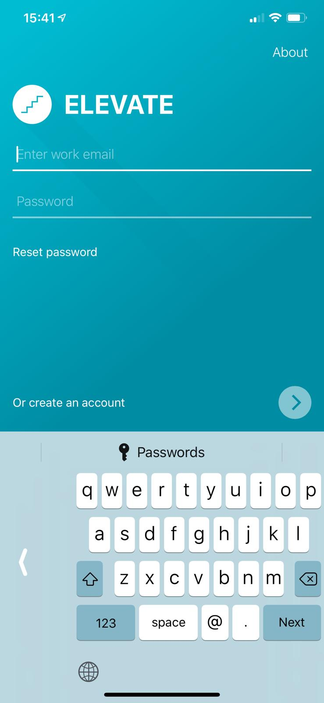
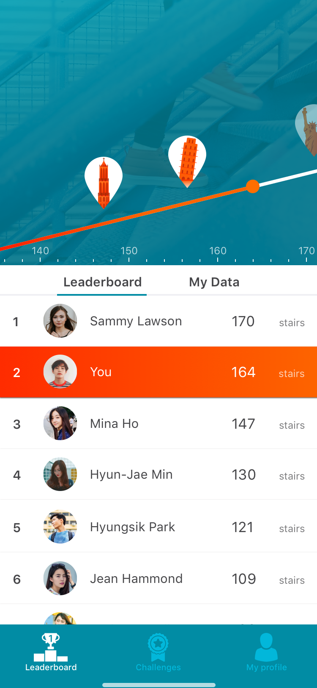
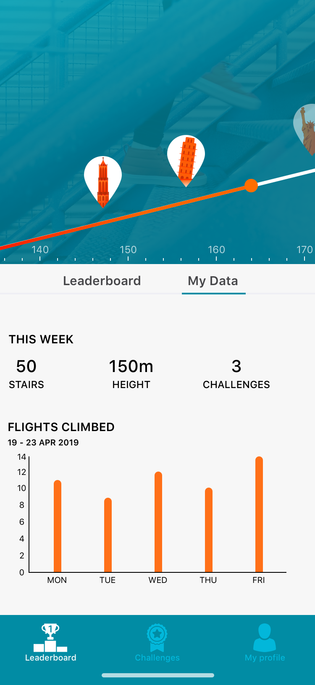
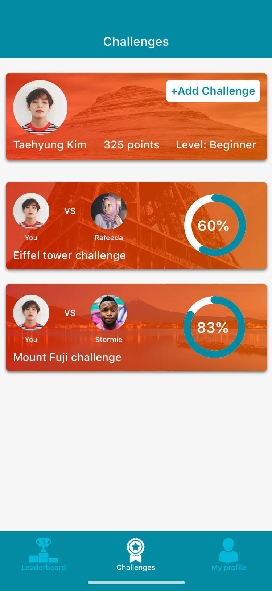
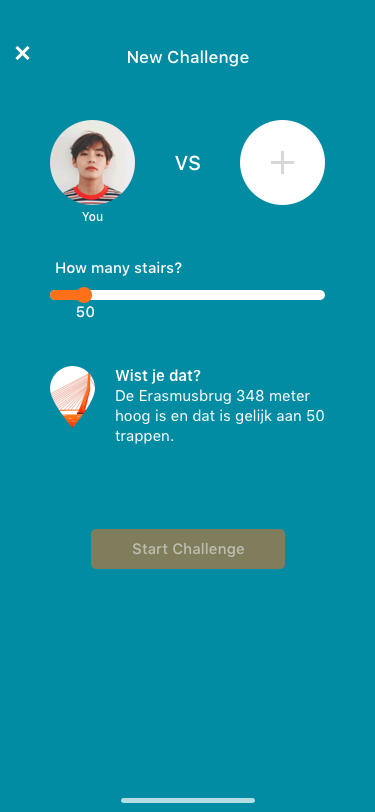
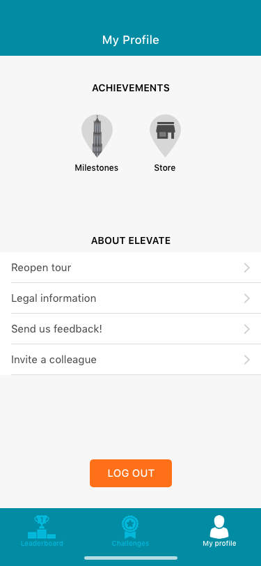

# Concept

#### Wie is de gebruiker?

De applicatie is voor werknemers die op kantoor werken en meer dan 8 uur per dag zitten achter hun bureau. 

#### Wat kunnen gebruikers doen met de app?

De applicatie kan de trappen tellen van de gebruiker. Elke trap omhoog wordt gemeten door middel van de barometer in de iPhone. 

#### Hoe werkt de leaderboard?

In de applicatie is er een leaderboard waar de gebruikers kunnen zien welke collega's de meeste trappen heeft gelopen. Elke maand wordt de leaderboard data gereset. Er is voor dit gekozen om gebruikers die vaak onderaan in de leaderboard staan, te motiveren om door te blijven gaan met trappen lopen. 

#### Wat zijn challenges?

De gebruikers kunnen collega’s uitdagen door middel van challenges. De challenges in de app zijn wedstrijden tussen collega’s wie het snelst een x aantal trappen kan lopen. De collega die als eerst het doel heeft behaald krijgt punten. Om de gebruikers te blijven motiveren krijgt de tegenstander ook punten maar minder dan de winnaar.  Het doel van de challenges is om collega’s te motiveren door een competitie aan te gaan met hun collega’s. De gebruikers kunnen punten verdienen met de challenges.

#### Waarom punten als beloning?

Er is een survey afgenomen onder de doelgroep en er is aan hun gevraagd of ze beloond willen worden voor het trappen lopen. Zo ja, hoe willen ze beloond worden? De gebruikers hebben aangegeven dat ze willen sparen om beloningen te kunnen kopen. Aan de hand van deze inzichten is ervoor gekozen de gebruikers te belonen met punten die ze kunnen besteden aan beloningen. De gebruikers krijgen punten wanneer ze een challenge voltooien. Zie de product biografie bij hoofdstuk [“survey”](https://s-sontoidjojo.gitbook.io/productbiografie/frame-problem-and-ideate/survey) voor de survey.

In de product biografie vindt u de [brainstorm sessie](https://s-sontoidjojo.gitbook.io/productbiografie/frame-problem-and-ideate/concepten), [schetsen](https://s-sontoidjojo.gitbook.io/productbiografie/frame-problem-and-ideate/schetsen) en [feedback](https://s-sontoidjojo.gitbook.io/productbiografie/frame-problem-and-ideate/feedback-frenzy) op mijn overige concepten. In de product biografie vindt u ook de [programma van eisen](https://s-sontoidjojo.gitbook.io/productbiografie/understand-and-empathize/programma-van-eisen). 

## Toelichting features

**Aanmelden/nieuw account aanmaken**  
1. De gebruiker kan op dit scherm zich aanmelden met hun werk emailadres  
2. De gebruiker vult hun naam in en kiest een wachtwoord.  
3. De gebruiker kiest een profielfoto of maakt een foto met hun camera  
4. De applicatie stuurt een bevestigingslink via de mail  
5. De gebruiker kan de app gebruiken zodra hun account bevestigd is

**Graphline en leaderboard**  
6. De gebruiker kan op een visuele manier zien op welke positie hij/zij staat  
7. De gebruiker ziet in de leaderboard hoeveel trappen andere collega’s hebben gelopen

**Statistieken**  
8. De gebruiker ziet hier hun eigen data  
9. De gebruiker kan zien hoeveel trappen ij/zij gelopen heeft in de afgelopen week

**Challenges**  
10. De gebruiker kan zien hoeveel challenges hij/zij heeft en met wie  
11. De gebruiker kan zien wat de voortgang is van de challenge

**Nieuwe challenge aanmaken**  
12. De gebruiker kan een nieuwe challenge maken  
13. De gebruiker moet een doel instellen hoeveel trappen ze willen lopen  
14. De gebruiker moet een collega kiezen om uit te dagen

**My profile**  
15. De gebruiker kan op deze scherm naar de winkel gaan om punten te ruilen voor een beloning  
16. De gebruiker vindt hier een overzicht van alle mijlpalen die ze behaald hebben  
17. De gebruiker kan de tour heropenen van de applicatie  
18. De gebruiker kan legale informatie over de app lezen  
19. De gebruiker kan feedback sturen naar de developers van de app  
20. De gebruiker kan een collega uitnodigen die nog niet is aangemeld  
21. De gebruiker kan uitloggen

  

