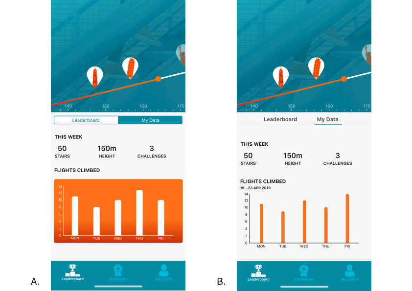
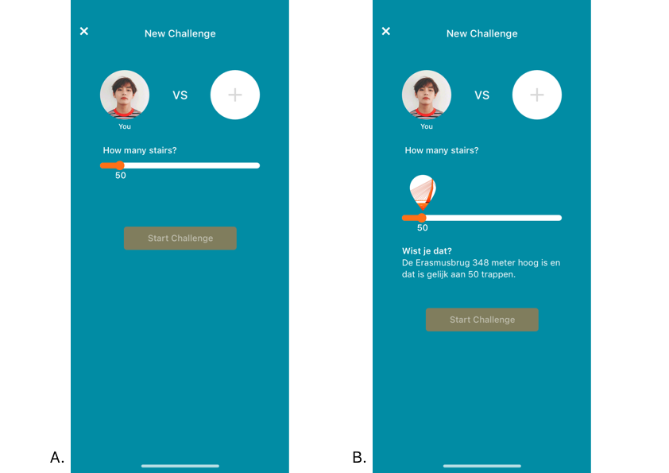

# Iteraties

Na een feedback sessie met de doelgroep zijn er een paar aanpassingen gemaakt aan het ontwerp. Er waren een paar dingen onduidelijk voor de doelgroep, dit heeft u kunnen lezen in het hoofdstuk 'Validatie' in de Design Rationale. Hieronder ziet u afbeeldingen van de iteraties. Versie B is alle uiteindelijke schermen voor de applicatie. 

