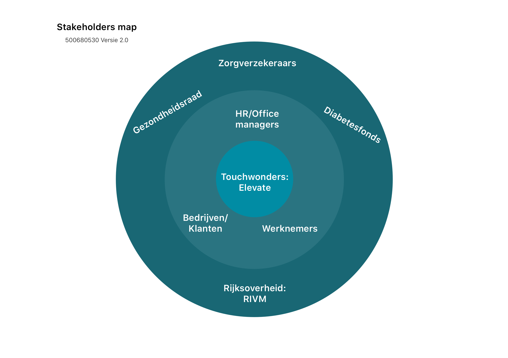
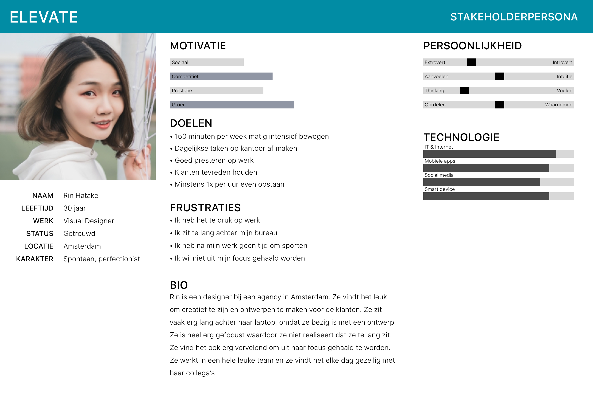

# Concurrentieanalyse

## Stakeholders

Om de stakeholders van Elevate te weergeven is er een Stakeholders map gemaakt. Deze methode wordt gebruikt om op een inzichtelijke manier te visualiseren wie de belangrijkste stakeholders zijn. Via de map wordt weergeven wie de directe en indirecte stakeholders zijn. Directe stakeholders zijn stakeholders die direct met het product te maken hebben. De indirecte stakeholders zijn stakeholders waar rekening mee gehouden moet worden, maar zijn niet belangrijk genoeg om keuzes te laten beïnvloeden.

Touchwonders is een van de stakeholders van Elevate. Zij zijn de ontwikkelaars en opdrachtgever en een van de belangrijkste stakeholders, omdat zij verantwoordelijk zijn voor de applicatie. Touchwonders is in dezelfde cirkel als Elevate, omdat Elevate een product is van Touchwonders.

De klanten van Elevate zijn alle bedrijven die gevestigd zijn in een kantoorgebouw met minimaal 2 verdiepingen. Het kunnen kleine bedrijven zijn, maar ook grote bedrijven of Gemeentes in Nederland. De klanten van Elevate zijn geïnteresseerd in het gezond houden of gezonder maken van hun medewerkers.

Een ander belangrijk stakeholder van Elevate zijn de mensen die verantwoordelijk zijn voor het welzijn van het personeel. Dit kunnen de HR managers zijn of de office managers. Tijdens de field trial is er een office manager geïnterviewd en er is aan haar gevraagd waarom ze mee wilt doen met de field trial. Ze heeft aangegeven dat ze op zoek is naar een methode om haar collega’s gezond te houden. Een van haar taken is om het \(ziekte\)verzuim te verminderen. Vanuit een sales perspectief zijn zij de belangrijkste stakeholders, maar ook vanuit het perspectief van een designer want zij bepalen of ze willen investeren in de applicatie. Het concept en het doel van de applicatie moet meerwaarde hebben en een oplossing bieden voor het verzuim voor de office managers.

De gebruikers van de applicatie zijn alle medewerkers van een bedrijf die gezonder willen zijn of meer willen bewegen op kantoor. Nederlanders zijn allemaal onbewust bezig met te lang zitten. Sommige mensen die zijn geïnterviewd zijn zich ervan bewust dat ze te veel zitten, maar ze hebben ook gezegd, dat ze soms zo gefocust zijn dat ze vergeten hoe lang ze hebben gezeten totdat ze naar de tijd kijken. Elevate kan hier een goede oplossing voor zijn. De gebruikers kunnen op een laagdrempelige manier aan hun gezondheid werken en stress verminderen.[ Baeten \(2017\)](https://s-sontoidjojo.gitbook.io/productbiografie/understand-and-empathize/literatuur-onderzoek/gezondheid-onderzoek/bewegen-tegen-een-burn-out-of-stress) concludeert in recent onderzoek dat bewegen stress vermindert. Matig intensief bewegen herstelt de hippocampus, waardoor de geheugenfunctie en het concentratievermogen weer verbeterd. Dus even weg gaan van je bureau om een verdieping of twee omhoog te gaan kan stress verlagen.

#### Doelgroep segmenten

De doelgroep is verdeeld in drie segmenten: bedrijven, HR managers en kantoormedewerkers. Er is voor iedere segment een persona gemaakt om de doelgroep duidelijk te weergeven. De persona’s zijn gebaseerd op de interviews die zijn afgenomen en literatuuronderzoek die uitgevoerd is via het internet. Bij afbeelding 3 ziet u de persona van de gebruiker. U kunt de persona’s van de andere segmenten vinden in de product biografie bij het hoofdstuk persona.

De doelgroep is specifieker gemaakt door te focussen op kantoormedewerkers, die graag actiever willen zijn tijdens kantooruren. Deze doelgroep is meer open voor verandering dan een groep die niet graag actief is. Uiteindelijk is het belangrijk om ook te focussen op de minder actieve medewerkers, maar voor dit project is het beter om eerst op één doelgroep te focussen, zodat het product haalbaar is.

#### Persona gebruiker

‌De persona van de gebruiker heet Rin en ze is 30 jaar oud. Ze werkt als een designer bij een agency in Amsterdam. Elk project waar ze aan werkt heeft een deadline waar ze zich aan moet houden. Ze wilt graag meer actief zijn maar heeft na haar werk geen tijd om te sporten, omdat ze boodschappen moet doen en thuis zelf moet koken. Rin kan goed gebruik maken van Elevate, omdat het een laagdrempelige manier is van bewegen tijdens kantooruren en dit zal niet in de weg staan van haar werk.‌

Persona's van andere stakeholders kunt u vinden in de product biografie bij het hoofdstuk '[Persona](https://s-sontoidjojo.gitbook.io/productbiografie/understand-and-empathize/gedrag-onderzoek/persona)'.  

## Best, good and bad practices

#### Waarom best, good and bad practices methode?

Dit is een methode dat wordt gebruikt om concurrenten te analyseren. Deze methode kan de sterke punten van de concurrenten in kaart brengen.

Deze methode helpt om te bepalen welke functies het beste passen bij de behoeftes van de gebruikers. Deze onderzoeksmethode is uitgevoerd door deskresearch te doen naar de concurrenten. Er een matrix gemaakt om te visualiseren waar Elevate staat in vergelijking met de concurrenten. In de product biografie bij hoofdstuk ‘[Concurrentie onderzoek](https://s-sontoidjojo.gitbook.io/productbiografie/understand-and-empathize/onderzoeksmethodes/best-good-and-bad-practices)’ kunt u meer informatie vinden over de analyse. 

#### Inzichten

* Fitcoins gebruikt een spaarsysteem om gebruikers te motiveren 
* Stepjockey gebruikt team challenges om de gebruikers te motiveren 
* Stridekick gebruikt de community om gebruikers te motiveren 
* Fitbit heeft een hele uitgebreide app waar de gebruikers familie en vrienden kunnen uitdagen, maar ze kunnen ook zichzelf uitdagen door een persoonlijke coach te huren via de app. 

Om het concurrentieonderzoek goed in kaart te brengen is er een matrix gemaakt om te weergeven op welke positie Elevate staat in tegenstelling tot de concurrenten. In de matrix ziet u de meeteenheden 'interactief', 'minimale interactie', 'motiveert de gebruiker' en 'uitdagend'. Deze eenheden zijn gekozen nadat de concurrenten zijn geanalyseerd. Uit de analyse is gekomen dat de concurrenten allemaal hun best doen om hun gebruikers te motiveren op een interactieve manier.

Zoals u in afbeelding \[\#\] kunt zien staat Elevate heel erg laag samen met een app die gemaakt is alleen voor het weergeven van data. Pedometer++ is een app die kan meten hoeveel stappen en trappen een gebruiker heeft gelopen. In vergelijking met andere concurrenten die wel hun gebruikers stimuleren om vaker te bewegen, staat Elevate op dezelfde plek als een applicatie die niet als doel heeft om de gebruikers op een interactieve manier te stimuleren. 

#### Wat neem ik mee uit het onderzoek?

* Andere mensen in je omgeving betrekken in je activiteiten helpt om actief te blijven
* Jezelf of andere mensen uitdagen wordt vaak gebruikt in apps
* Elevate moet net zo interactief zijn als Fitbit en Stridekick
* Gamification kan helpen om doel te bereiken

