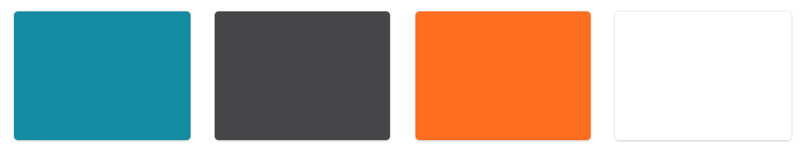

# Design

## Huisstijl

De kleuren van Elevate zijn tijdens de pilot al bepaald door de designer van Touchwonders. In de onderstaande afbeelding ziet u de huisstijl kleuren. 

#### Font style

De font van de applicatie is 'SF Pro Text'. De stijlen die worden gebruikt zijn 'regular' en 'semi-bold'.

Voor heading stijlen wordt ook 'SF Pro text' gebruikt. De stijlen die gebruikt worden voor headings zijn 'regular', 'light' en 'bold'.

## Navigatie

De navigatie is een tabbar, omdat Apple in 2014 besloot dat navigeren in een mobiele applicatie met een tabbar beter is. Elevate volgt ook de richtlijnen van iOS in het design. Een van de drie dingen wat belangrijk is voor een gebruiker is weten waar ze zijn, waar ze willen gaan en wat ze gaan vinden als ze er zijn. De tabbar voldoet aan al deze eisen. 

## Persuasive design

### Motivation

De motivatie voor de gebruikers is om een vriendelijke competitie aan te gaan met hun collega's. Door het sociale aspect wordt de gebruiker sneller gemotiveerd. In de app kan de gebruiker een challenge aanmaken en een collega uitnodigen om mee te doen. Elke keer als ze een challenge afronden dan krijgen de gebruikers punten als beloning.

### Ability

Het is belangrijk dat de gebruiker zelf kan instellen hoeveel trappen ze willen lopen in een challenge. Het moet een doel zijn voor hun dat haalbaar is. In de applicatie kan de gebruiker ook instellen hoeveel trappen ze willen lopen met hun collega.

### Triggers

De gebruikers kunnen met de punten die ze gespaard hebben een beloning kopen. Wat de beloning wordt moet bepaald worden in overleg met de klanten van Elevate. 

