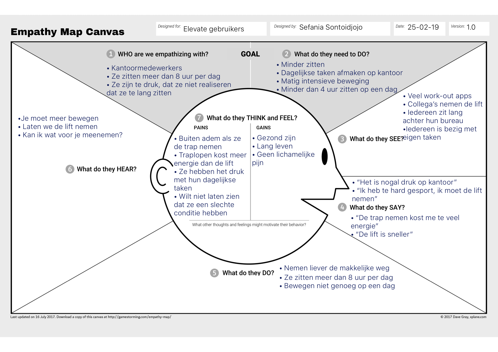
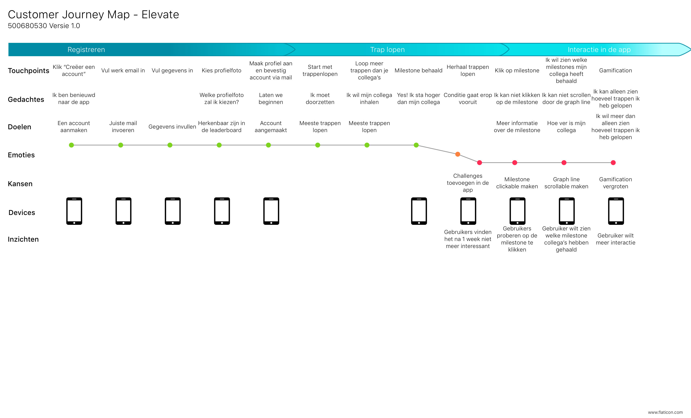

# Doelgroeponderzoek

## Doelgroep

Om de doelgroep beter te begrijpen zijn er verschillende soorten onderzoek gedaan naar hun. Waaronder ook literatuur onderzoek, dit kunt u lezen in de product biografie bij hoofdstuk [Onderzoeksvragen: gezondheid](https://s-sontoidjojo.gitbook.io/productbiografie/understand-and-empathize/literatuur-onderzoek/gezondheid-onderzoek/onderzoeksvragen-gezondheid).

## A day in the life

#### Waarom a day in the life?

A day in the life is een methode waarbij een gebruiker de hele dag wordt geobserveerd. Er is gekozen om dit te doen zodat geobserveerd kan worden hoe de gebruiker zich gedraagt in hun normale omgeving.

#### Inzichten

Uit het onderzoek 'A day in the life' kan geconcludeerd worden dat de gebruiker die gevolgd werd het moeilijk vind om over de drempel te stappen richting een gezonder leven. De persoon die gevolgd werd is een roker en zit lang achter een bureau. De gebruiker is heel snel buiten adem als ze twee verdiepingen omhoog moet. De gebruiker neemt liever de lift, omdat dit minder energie kost voor haar. Maar wanneer ze aangemoedigd wordt om de trap te nemen dan gaat ze ook mee om de trap te nemen.

De collega’s van de gebruiker zitten ook lang achter hun bureau. Sommige collega’s waren wel de hele tijd heen en weer aan het lopen, omdat het onderdeel was van hun dagelijkse taken. Maar ook die collega’s namen de lift omhoog. Voor verdere toelichting van mijn onderzoek verwijs ik u naar de product biografie bij het hoofdstuk[ 'a day in the life'](https://s-sontoidjojo.gitbook.io/productbiografie/understand-and-empathize/gedrag-onderzoek/a-day-in-the-life/persoon-1).

#### Wat neem ik mee?

* De gebruiker kan aangemoedigd worden om de trap te nemen
* De gebruiker vindt dagelijkse taken afmaken belangrijk
* De gebruiker wordt beïnvloed door collega’s
* Het systeem van belonen voor goed gedrag zou werken voor deze doelgroep.

## Fly on the wall

#### Waarom?

De methode fly on the wall observeert een groep mensen tegelijkertijd voor een korte periode. Dit kan meerdere keren op een dag en hoeft dus niet de hele dag te gebeuren. Belangrijke momenten om de doelgroep te observeren zijn wanneer ze naar kantoor gaan, wanneer ze gaan lunchen en als ze naar een andere verdieping moeten gaan. 

#### Inzichten

Er kan geconcludeerd worden dat een team dat elkaar motiveert om na de lunch te gaan wandelen en samen bewust is van het feit dat ze te veel zitten, sneller geneigd zijn om de trap te nemen. Wanneer er collega's zijn die er soms geen zin in hebben om de trap te nemen, zijn er collega's die anderen proberen te motiveren om de trap te nemen. Door de groepsdruk geven sommige collega's in en nemen ze dan toch de trap in plaats van de lift. Voor verdere toelichting over de inzichten verwijs ik u naar de product biografie bij het hoofdstuk[ 'fly on the wall'](https://s-sontoidjojo.gitbook.io/productbiografie/understand-and-empathize/gedrag-onderzoek/fly-on-the-wall).

#### Wat neem ik mee uit het onderzoek?

* Doelgroep is beïnvloedbaar onder groepsdruk 
* Bewustzijn creëren bij de doelgroep is belangrijk
* Een team die elkaar motiveert speelt een grote rol bij trappen lopen of lift nemen
* Team doet vaak dingen samen zoals roken en wandelen

## Empathy map

#### Waarom?

De Empathy map is een methode die wordt gebruikt om de gebruiker beter te begrijpen. Dit creëert een overzicht over de wensen en behoeftes van de gebruiker. De Empathy map is gebaseerd op de mensen in een kantoor en op de campus. Deze doelgroep is gekozen, omdat het mensen zijn die heel lang zitten. Deze mensen werden geobserveerd in hun natuurlijke omgeving.

#### Inzichten

Aan de doelgroep werd gevraagd of ze de trap nemen of de lift en waarom? Uit de antwoorden van de doelgroep kan geconcludeerd worden dat de lift nemen makkelijker is. Als de trappenhuis verborgen is, dan kiezen de meeste mensen om de lift te nemen.

Uit de gesprekken kan ook geconcludeerd worden dat mensen voor 1 of 2 verdiepingen het niet erg vinden om de trap te nemen, maar als het meer dan 2 verdiepingen zijn dan nemen ze liever de lift. In de Empathy map ziet u een beknopte overzicht van de meest interessante bevindingen. Zie de product biografie bij hoofdstuk [Empathy map](https://s-sontoidjojo.gitbook.io/productbiografie/understand-and-empathize/gedrag-onderzoek/empathy-map).

## Customer Journey Map

#### Waarom?

De Customer Journey Map is een methode die wordt gebruikt om de journey van de gebruiker in kaart te brengen. Dit creëert een overzicht van alles wat de doelgroep doet en denkt zoals de pijnpunten, gedachtes, touchpoints en kansen. De CJM is gebaseerd op de ervaringen van de doelgroep tijdens de Field trial. Zie afbeelding \[\#\] voor de CJM.

#### Inzichten

Zoals u kunt zien op afbeelding \[\#\] verlopen de eerste stappen van de applicatie naar wens. Het gaat mis wanneer de gebruiker het gevoel heeft dat er geen uitdaging meer is. De gebruiker mist een stukje interactie in de app. Dit heeft de doelgroep ook aangegeven in de interviews, dit kunt u lezen in de product biografie bij het hoofdstuk[ 'field trial interviews'](https://s-sontoidjojo.gitbook.io/productbiografie/understand-and-empathize/gedrag-onderzoek/field-trial/field-trial-interviews).

Deze inzichten bieden kansen zoals challenges toevoegen in de app waardoor de app meerwaarde krijgt voor de gebruiker en het uit kunnen dagen van collega's. Daarnaast moet de applicatie meer interactief zijn door sommige dingen zoals de mijlpalen klikbaar te maken en meer informatie te geven over de mijlpalen. Dit is gebaseerd op de suggesties van de doelgroep, waar bovenaan al aangegeven is dat het uit de interviews is gehaald.

#### Wat neem ik mee hieruit?

* De gebruikers willen uitgedaagd worden
* De gebruikers willen meer interactie in de applicatie
* De huidige app van Elevate voldoet niet aan de behoeftes van de doelgroep
* De gebruiker wilt meer informatie lezen in de app

