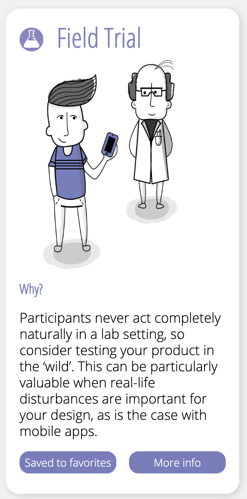

# Field trial

 

Aan het begin van de afstudeerproject is een field trial gestart met een aantal gebruikers uit de doelgroep. Ze werken in een deelpand maar elk persoon werkt voor een ander bedrijf en iedereen heeft een andere functie. In de testgroep is er een office manager, marketing manager, developers en een paar leidinggevende. Er is bewust gekozen om de interviews pas te doen na de field trial, omdat het eerste indruk van de applicatie gemeten moest worden maar ook de ervaring nadat de gebruiker het een tijdje heeft gebruikt. 

De field trial is een periode waar de gebruikers een versie van de applicatie testen. De huidige versie van Elevate was gebouwd maar nooit getest door gebruikers. Een van de doelen van de field trial was om erachter te komen wat de doelgroep vindt van zo'n app, maar nog belangrijker willen ze een app gebruiken die alleen trappen kan meten. 

Uit de interviews kan geconcludeerd worden dat de gebruikers het concept van Elevate erg interessant vinden, maar de huidige app is niet interactief genoeg. Ze vinden het idee dat je met elkaar concurreren wie de meeste trappen kan lopen heel erg geinig. De meeste gebruikers hebben aangegeven best wel competitief te zijn. 

De gebruikers hebben aangegeven dat ze het leuk zouden vinden als ze op de mijlpalen kunnen klikken voor meer informatie. Daarnaast hebben de gebruikers ook aangegeven dat ze een overzicht willen van hun data, zodat ze het kunnen vergelijken met andere dagen. Door deze inzichten is er besloten om deze functies te verwerken in het concept van Elevate. De doelgroep heeft ook aangegeven dat ze minstens 2 keer per week actief bewegen. Dat betekent dat ze gemotiveerder zullen zijn om de trap te nemen. Als u meer wilt lezen over de inzichten van de interviews dan kunt u het vinden in de productbiografie bij het hoofdstuk ['field trial interviews'](https://s-sontoidjojo.gitbook.io/productbiografie/understand-and-empathize/gedrag-onderzoek/field-trial/field-trial-interviews).

\*\*\*\*

