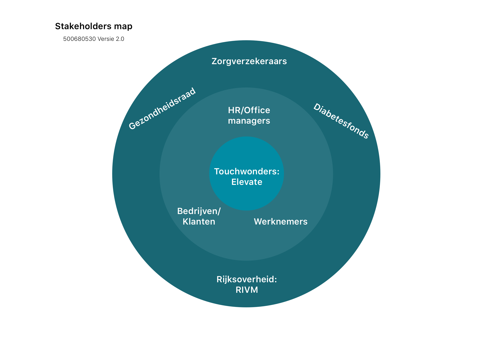
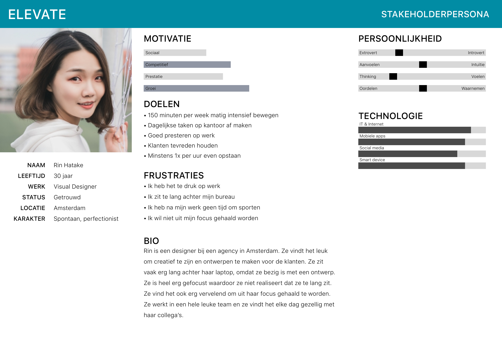

# Project Elevate

## Huidige situatie

Tijdens het afstudeerproject is er een field trial gelanceerd voor de applicatie Elevate in de huidige situatie. Zes mensen hebben zich vrijwillig aangemeld om te helpen met het onderzoek. 

De pilot versie van Elevate is heel erg minimaal. Het kan de trappen meten en het koppelen aan een mijlpaal. In de app zijn er een aantal mijlpalen die gelijk zijn aan het gelopen trappen zoals de Eiffeltoren, de Erasmusbrug, de Markthal en nog veel meer. Daarnaast kan de gebruiker ook zien op welke rank ze staan in de leaderboard en op welke rank hun collega’s staan. Door het koppelen van het aantal gelopen trappen met mijlpalen, kan de gebruiker visualiseren hoe hoog het aantal trappen zijn die ze gelopen hebben. 

Uit de interviews, die plaats hebben gevonden na de field trial, blijkt dat de testers het concept een leuk idee vinden, maar ze vinden de applicatie nog heel erg minimaal. De gebruikers willen heel graag meer interactie in de app zoals de mijlpalen klikbaar maken of informatie geven over de mijlpalen. Daarnaast willen ze ook zien waar hun collega’s staan in de graph line. Zie de begrippenlijst voor toelichting over de graph line.

Één tester geeft aan dat hij het leuk zou vinden als het gamification element meer terug kwam in de applicatie. Ze hebben het allemaal 1 week volgehouden om de applicatie dagelijks te gebruiken, maar daarna was de lol ervan af. De applicatie had geen meerwaarde voor hun en ze gebruikten de applicatie alleen nog om het aantal trappen te meten, maar ze hebben niet meer dagelijks in de applicatie gekeken. De interviews kunt u lezen in de productbiografie in het hoofdstuk 'field trial interviews'.

## De stakeholders 

Om de stakeholders van Elevate te weergeven is er een Stakeholders map gemaakt. Deze methode wordt gebruikt om op een inzichtelijke manier te visualiseren wie de belangrijkste stakeholders zijn. Via de map wordt weergeven wie de directe en indirecte stakeholders zijn. Directe stakeholders zijn stakeholders die direct met het product te maken hebben. De indirecte stakeholders zijn stakeholders waar rekening mee gehouden moet worden, maar zijn niet belangrijk genoeg om keuzes te laten beïnvloeden. 

Touchwonders is een van de stakeholders van Elevate. Zij zijn de ontwikkelaars en opdrachtgever ****en een van de belangrijkste stakeholders, omdat zij verantwoordelijk zijn voor de applicatie. Touchwonders is in dezelfde cirkel als Elevate, omdat Elevate een product is van Touchwonders. 

De klanten van Elevate zijn alle bedrijven die gevestigd zijn in een kantoorgebouw met minimaal 2 verdiepingen. Het kunnen kleine bedrijven zijn, maar ook grote bedrijven of Gemeentes in Nederland. De klanten van Elevate zijn geïnteresseerd in het gezond houden of gezonder maken van hun medewerkers. 

Een ander belangrijk stakeholder van Elevate zijn de mensen die verantwoordelijk zijn voor het welzijn van het personeel. Dit kunnen de HR managers zijn of de office managers. Tijdens de field trial is er een office manager geïnterviewd en er is aan haar gevraagd waarom ze mee wilt doen met de field trial. Ze heeft aangegeven dat ze op zoek is naar een methode om haar collega’s gezond te houden. Een van haar taken is om het \(ziekte\)verzuim te verminderen. Vanuit een sales perspectief zijn zij de belangrijkste stakeholders, maar ook voor vanuit het perspectief van een designer want zij bepalen of ze willen investeren in de applicatie. Het concept en het doel van de applicatie moet meerwaarde hebben en een oplossing bieden voor het verzuim voor de office managers. 

De gebruikers van de applicatie zijn alle medewerkers van een bedrijf die gezonder willen zijn of meer willen bewegen op kantoor. Nederlanders zijn allemaal onbewust bezig met te lang zitten. Sommige mensen die zijn geïnterviewd zijn zich ervan bewust dat ze te veel zitten, maar ze hebben ook gezegd, dat ze soms zo gefocust zijn dat ze vergeten hoe lang ze hebben gezeten totdat ze naar de tijd kijken. Elevate kan hier een goede oplossing voor zijn. De gebruikers kunnen op een laagdrempelige manier aan hun gezondheid werken en stress verminderen. Baeten \(2017\) concludeert in recent onderzoek dat bewegen stress vermindert. Matig intensief bewegen herstelt de hippocampus, waardoor de geheugenfunctie en het concentratievermogen weer verbeterd. Dus even weg gaan van je bureau om een verdieping of twee omhoog te gaan kan stress verlagen. 

De doelgroep is verdeeld in drie segmenten: bedrijven, HR managers en kantoormedewerkers. Er is voor iedere segment een persona gemaakt om de doelgroep duidelijk te weergeven. De persona’s zijn gebaseerd op de interviews die zijn afgenomen en literatuur onderzoek die uitgevoerd is via het internet. Bij afbeelding 3 ziet u de persona van de gebruiker. U kunt de persona’s van de andere segmenten vinden in het productbiografie bij het hoofdstuk persona. 

De doelgroep is specifieker gemaakt door te focussen op kantoormedewerkers, die graag actiever willen zijn tijdens kantooruren. Deze doelgroep is meer open voor verandering dan een groep die niet graag actief is. Uiteindelijk is het belangrijk om ook te focussen op de minder actieve medewerkers, maar voor dit project is het beter om eerst op één doelgroep te focussen, zodat het product haalbaar is. 

De persona van de gebruiker heet Rin en ze is 30 jaar oud. Ze werkt als een designer bij een agency in Amsterdam. Elk project waar ze aan werkt heeft een deadline waar ze zich aan moet houden. Ze wilt graag meer actief zijn maar heeft na haar werk geen tijd om te sporten, omdat ze boodschappen moet doen en thuis zelf moet koken. Rin kan goed gebruik maken van Elevate, omdat het een laagdrempelige manier is van bewegen tijdens kantooruren en dit zal niet in de weg staan van haar werk. 

