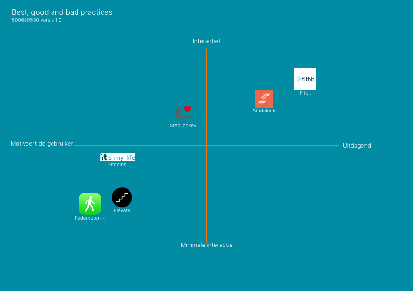

# Concurrentie

De best, good and bad practices methode is een methode van de CMD Method kaarten. Het is een handige tool om in kaart te brengen wat de verschillen zijn tussen de concurrenten en het product van de opdrachtgever. 

Om het concurrentieonderzoek goed in kaart te brengen is er een matrix gemaakt om te weergeven op welke positie Elevate staat in tegenstelling tot de concurrenten. Zoals u in afbeelding ****6 kunt zien staat Elevate heel erg laag samen met een app die gemaakt is alleen voor het weergeven van data. Pedometer++ is een app die kan meten hoeveel stappen en trappen een gebruiker heeft gelopen. In vergelijking met andere concurrenten die wel hun gebruikers stimuleren om vaker te bewegen, staat Elevate op dezelfde plek als een applicatie die niet als doel heeft om de gebruikers op een interactieve manier te stimuleren. 

Het doel van Elevate is om in dezelfde regio te staan als Fitbit en Stridekick. Deze twee applicatie zijn heel erg interactief en motiveren de gebruiker om meer te bewegen. Fitbit heeft een onderdeel in de app waar vrienden en familie hun fitness ervaringen kan delen, maar familie en vrienden kunnen de gebruiker uitdagen en andersom. Stridekick heeft ongeveer hetzelfde concept waarbij de gebruiker vrienden en familie kan uitdagen en daarnaast kan de gebruiker verschillende devices gebruiken voor de applicatie. Zoals de fitbit, Apple watch, Android, iPhone etc. Voor meer informatie over de best, good and bad practices inzichten verwijs ik u naar de productbiografie bij het hoofdstuk best, good and bad practices.

Dit doel kan behaald worden door gamification toe te voegen aan de applicatie. In het hoofdstuk 'Het concept' kunt u meer lezen over de concepten die bedacht zijn voor Elevate.

